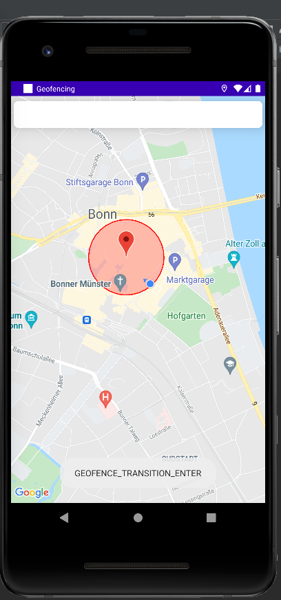

## Geofencing in Android

A geofence is a virtual boundary around a physical location. Geofences are monitored, and when an authorized mobile device enters or exits the geofence, an alert is sent.

### App
Using Google Geofencing API, this app allows you to create a geofence with a certain radius and send notifications when the device enters or exit the geofence or dwelling inside the geofence.

### Screens
